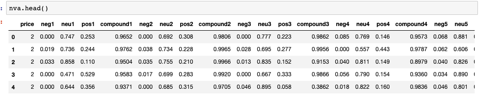
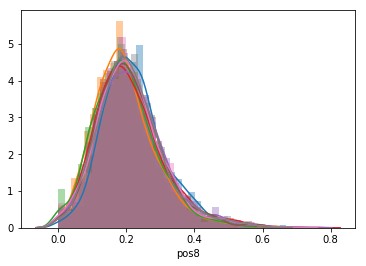
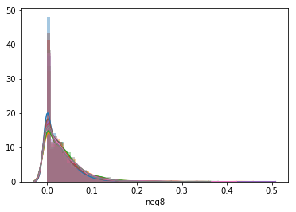
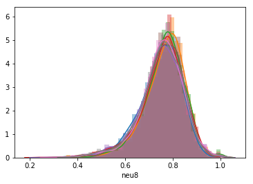
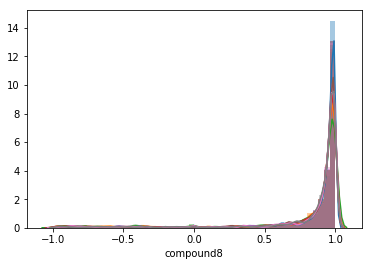
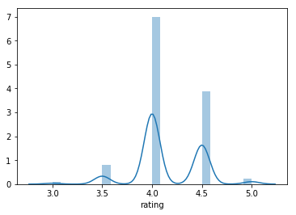
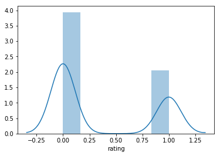

## PROJECT DESCRIPTION and JUSTIFICATION
Using Natural Language Processing (NLP) we analyzed Yelp reviews and performed a sentiment analysis on each review to predict if a restaurant was good or not (4.5 stars or above).

Yelp is a very democratic review system where customers share their honest opinion about places they have visited. The final rating of a place (in our case restaurants) is highly biased by the individual rating. Since most reviews swing wildly between love and hate, with very few in between, many overall restaurant ratings tend to settle in the 4s, with the very best restaurants able to achieve a 4.5.  In conversations with members of the restaurant industry, it was discovered that many restaurants are aware of this phenomenon, and hence, settle for a 4 star rating.

Some restaurants dislike this system because it does not account for the areas in which they either succeed or fall behind during a diner's experience.  A reviewer may give a restaurant 1-star review for service, but the food may be excellent, or vice versa.  Those reviewers that do try to take this into account must weight their own rating based on their own personal beliefs, and thus leave an unbalanced review without a proper guide.

While Yelp is an absolute treasure trove of user data, its highly subjective nature makes difficult to properly classify a score using traditional Machine Learning techniques.  With almost 60% of our selected restaurants in New York City rated on Yelp rated at 4, and 93% rated at 4 or higher, one would surmise that New York is the absolute Mecca of fine dining.  Having dined here for over 20 years, we the authors can assure you this is in fact, not the case. 

Armed with this information, and the data we obtained, we then focus on answering the below questions.

## QUESTIONS
1. Can the quality of a restaurant be ascertained based on user sentiment alone?  
2. Can we ascertain if a restaurant is good (4.5 stars or above) based on user sentiment?

## DATA

The data for this analysis was obtained from 2 separate YELP API calls of 1000 restaurants each in the New York City metropolitan area.  We then used the Yelp Restaurant IDs to scrape 20 reviews from each of those restaurants.  Unfortunately, due to Yelp's Review API's limit of 3 truncated reviews per call, we felt that the results would be insufficient to do a proper sentiment analysis.

Post cleaning for missing values, we were left with 1625 restaurants, and 32,500 reviews.

### METHODOLOGY AND EDA

In order to determine sentiment, we first ran a VADER Sentiment analysis of our collected reviews.  The VADER Sentiment Analysis broke down each review and returned 4 scores which reported the percentage of Negative, Neutral, and Positive sentiment, and a final compounded score.  Our resulting data looked like the below:

Further breakdown showed an unusually high distribution of positive sentiment scores and neutral sentiment scores, and a very low distribution of negative sentiment scores.

positive  
  
negative  
   
neutral  
   
compound  
  

This was also paired with the overweighted distribution of 4-star reviews, as seen below:

Given the breakdown, we elected to separate the restaurants along 4.5-Star reviews and above as being "Good" restaurants, and anything 4-star and below as a "Bad" restaurant.  Below is the histogram of the two classes:

### FINDINGS

Our findings were directed towards properly classifying if a restaurant was good or bad based on Vader's sentiment analysis.  We removed the compound score as superfluous, and wanted to train our model on the levels of negative/neutral/positive sentiment in order to determine the best restaurant.  In addition, we wished to pick the model that would best reduce Type I errors in exchange for Type II errors, as we feel, going to a restaurant rated poorly and discovering it is actually good would be more desireable than going to a restaurant known to be good and discovering it is bad.  The below is a summary of the models we ran:

#### Models

Dummy Classifer: 52.3%

Naive Bayes:	Gaussian/Bernoulli  	
Accuracy Score: 58% / 52%  	
F1 Score: 59%/54%  
KNN: n=2; Tuning using GridSearch  	
Accuracy Score: 52%  	
F1 Score: 40%  
Decision Trees: Tuning using GridSearch  
Accuracy Score: 57%  
F1 Score: 58%  
Bagged Trees: n=20;Tuning using GridSearch  
Accuracy Score: 64%  
F1 Score: 63%  
Random ForestsL: Tuning - bootstrap  
Accuracy Score: 66%  
F1 Score: 63%  
XG Boost: Genetic Search  
Accuracy Score; 65%  
F1 Score: 65%  
SVM: Kernel Linear; c=6	 
Accuracy Score: 56%  
F1 Score: 57%
